# Lab 2: Analog Circuitry and FFTs

## Goals
The goal of this lab is to use signal processing for treasure-detecting sensors and a microphone sensor. We used the Open Music Lab FFT library for Arduino to implement a digital filter. The acoustics sub-team, composed of Shanee, Daniel, and David, attached a microphone to distinguish a 660 Hz audible start signal; the optical sub-team, composed of Aasta, Erika, and Ben, attached an IR sensor to detect treasures emitting IR light at 7 kHz, 12 kHz, and 17 kHz.
Background Information
Before we begin, let’s get started with some relevant background information for this lab.

## What’s an FFT?
The Fourier Transform is an operation that can change a signal in the time domain to a the frequency domain and vice versa. This allows us to view the most prominent frequencies present in our signal. We will be using this to detect the different optical signals emitted by the “treasures” and the audio start signal.

The Fast Fourier Transform (or FFT) is an algorithm used to calculate the Fourier Transform on a discrete signal. FFT usually takes three steps: decomposition, finding the spectra of each point, and reordering the data from each point. The first step of the FFT algorithm is to break up the signal into individual data points and sort the data. This is usually done in terms of time and requires that the signal have a length that is a power of two. Once the signal is decomposed, the frequency spectrum of each datapoint is taken and then all the points are sorted back together. 

For going from the time to frequency domain, the resulting output of an FFT is an array of “bins” with each bin representing a range of frequencies. Each data point holds information in two bins. In Open Music Lab’s implementation of the FFT, the even bins are used to store the real component of the signal while the odd bins are used for the imaginary component. To find the magnitude of the frequency at each data point, we simply have to add the squares of the magnitudes for the real and imaginary components and take the square root. This is simple since we assume our signal is completely real and assign zeros for all the imaginary components. After completing the FFT, we can now see which bin and therefore which frequencies in our signal had the highest magnitude.

This is only a brief explanation of the FFT, for more information about FFT algorithms check out Wolfram Alpha and the DSP Guide. 

For sample calculations of each bin’s frequency range and determining the most prominent frequency in our signal see calculations in the Acoustic Team and Optical Team sections. 

## Signal Manipulation: Amplification and Filtering
For our goal, we need to worry about two aspects of the input signal: the strength of the signal that our sensor can detect and the accuracy of the frequency we calculate from the signal. 

These two characteristics can be handled using an amplifier and filter, respectively.

An amplifier increases the magnitude of the input signal from our sensor that is sent to the arduino for analysis. It allows us to detect signals at a farther distance. A common amplifier used in circuits is the operational amplifier or op-amp which amplifies the voltage difference at the two legs of the op-amp. 

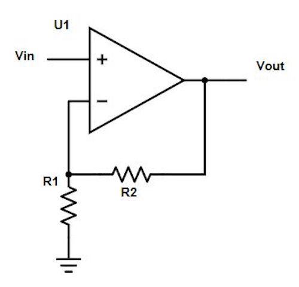

Figure 1. Typical Non-inverting Operational Amplifier

Notice the resistors attached to the negative leg of the op-amp (Figure 1), this is a feedback loop. Feedback loops are usually a network of resistors and capacitors that create a transfer function between the input and output of the amplifier. The ratio and configuration of these components determine the gain, or level of amplification of our output signal compared to the input signal. In this case the gain is 1+ R2/R1.

Read more about op amps here.

Filters are important for removing noise that may interfere with the signal we want to detect. For example, if we want to detect a 660 Hz starting signal, we have to ensure that other frequencies from background noise or talking will not interfere with our sensor. There are three different types of filters: low-pass, high-pass, and band-pass. Low-pass filters allow frequencies below a threshold value, called the cut-off frequency, to pass unaltered while diminishing the magnitude of frequencies above cut-off. A high-pass filter does the opposite and leaves frequencies greater than the cut-off frequency unaltered while filtering out lower frequencies. The band-pass filter combines the low-pass and high-pass filter and only allows frequencies within a certain range (or band) to pass through.

## Required Materials
### Acoustic Team:

> Arduino Uno
> Electret microphone
> 1 µF capacitor
> 300 Ω resistors
> ~3 kΩ resistor

### Optical Team:

> Arduino Uno
> IR receiver
> 300 Ω resistors
> Treasure board 
> Analog filter circuit
> Breadboard
> Procedure
> Acoustic Team

Before implementing the microphone circuit, we looked over the Open Music Labs Arduino FFT library documentation and the ADC on the Arduino microcontroller (ATmega328). The datasheet (beginning section 28, page 305) indicates that:

> The ADC has 10-bit resolution
> At a resolution of 10 bits, an ADC conversion takes 13 clock cycles.
> The ADC clock is preset at a speed of 125 kHz. Therefore, the preset ADC sampling frequency is 125 kHz / 13 = 9.6 kHz.
> The ADC sampling frequency of 9.6 kHz is using the default prescaler of 128, which can be set using the last 3 bits of the ADCSRA register. Max sampling frequency is 615 kHz at a prescaler of 2.
> For maximum resolution, the Arduino takes an input clock frequency of 50 to 200 kHz.
> ADC initialization takes 15 clock cycles.
> The output is stored in ADCL and ADCH and is 1024*(analog input voltage)/5V.
> The ADC can be set to Free Running mode to continuously update the ADCL and ADCH values. 

The analogRead function has a sampling frequency of 10 kHz, which is sufficient for detecting an audio signal of 660 Hz, but faces limitations in terms of available analog pins. As a result we decided to use ADC directly.


## Using fft_adc_serial

After installing the Open Music Labs FFT library, we looked at the fft_adc_serial example which performs FFT on the analog input and prints the magnitude on the serial monitor. To test the script, we used a signal generator to produce a 660 Hz, 1 Vpp signal with zero offset and plotted the data that was printed in serial by the example script into a graph in excel. We performed this for analogRead and ADC read. These graphs are shown in figure 2 and 3. We also measured the signal with an oscilloscope to confirm the signal’s frequency shown in figure 4.

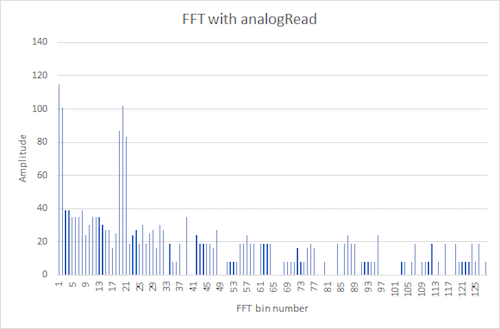

Figure 2. FFT using analogRead with signal generator input 660 Hz

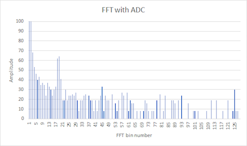

Figure 3. FFT using ADC with signal generator input 660 Hz

To compare the ADC with analogRead, in figure 2 the 660 Hz peak showed up at around the 18th bin using the ADC, whereas in figure 3 the 660 Hz peak showed up around the 20th bin using analogRead due to the additional delay of analogRead, confirming our decision to use the ADC.

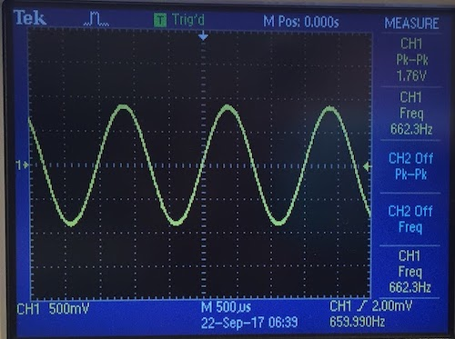

Figure 4. Oscilloscope measurement with signal generator input 660 Hz

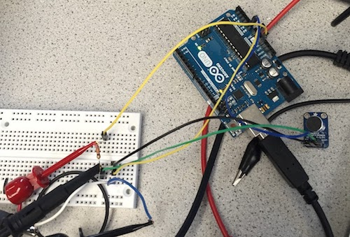

Figure 5. Microphone circuit with signal generator input and oscilloscope measurement.

We then connected the microphone to the Arduino as shown in figure 5. and used the FFT library to analyze the data. 660 Hz was found to be in bin 5 which matches the following calculation, where 4.39 is 5 due to software delay.

> 16MHz/32 prescalar/ 13 clock cycles/ 256 samples = 150.24Hz
> 660Hz/150.24Hz=4.39

However, 735 Hz would also fall into bin 5 since

> 735Hz/150.24Hz=4.89

To increase our resolution in frequency analysis, we increased the clock division factor from 32 to 128. This was done by changing ADCSRA’s value in the FFT example script shown in figure  from 0xe5 to 0xe7 in setup{ }, and from 0xf5 to 0xf7 in loop{ }. The LSB in 0xe5 and 0xf5 are 101 which correspond to clock division factor 32, and the LSB in 0xe7 and 0xf7 are 111 which correspond to clock division factor 128. This information is found in the Atmega328 datasheet table 28-5. Since the given script takes 256 samples for each FFT run, each bin has a width of 37.5 Hz (9600/256). The following equations were realized

> 16MHz/128 prescalar/ 13 clock cycles/ 256 samples = 37.56Hz
> 660Hz/37.65Hz=17.53
> 585Hz/37.65Hz=15.54
> 735Hz/37.65Hz=19.52

The 128 clock division factor increased the spacing between 660Hz, 585Hz, and 735Hz and made it a simple task to use software to differentiate between these tones as shown in figure 5. A MATLAB script in figure 8 was setup to read data from Arduino serial port and plot the data in figure 5.

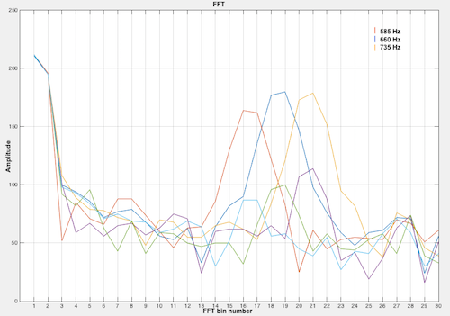

Figure 6. MATLAB FFT plot with 585, 660, and 735 Hz frequencies.


This code in figure 7 takes 256 samples and uses FFT functions to detect whether the input frequency is 660Hz. This code was tested with input frequencies of 585Hz, 660Hz, and 735Hz. A built in LED, circled in figure 9, on the Arduino is lit to indicate that 660Hz is detected, and the built in LED is off when a frequency less than or equal to 585Hz, or greater than or equal to 735Hz. This video shows the built in LED reacting to the three input frequencies: https://youtu.be/tWlF1rdGw6Y

```
/*
fft_adc.pde
guest openmusiclabs.com 8.18.12
example sketch for testing the fft library.
it takes in data on ADC0 (Analog0) and processes them
with the fft. the data is sent out over the serial
port at 115.2kb.  there is a pure data patch for
visualizing the data.
*/

#define LOG_OUT 1 // use the log output function
#define FFT_N 256 // set to 256 point fft

#include <FFT.h> // include the library

void setup() {
  pinMode(LED_BUILTIN, OUTPUT); // The built in LED indicates if 660Hz is detected
  TIMSK0 = 0; // turn off timer0 for lower jitter
  ADCSRA = 0xe7; // free running mode and set three LSB to 111 to make clock divider 128
  ADMUX = 0x40; // use adc0
  DIDR0 = 0x01; // turn off the digital input for adc0
  Serial.begin(9600); // use the serial port
}

void loop() {
  while(1) { // reduces jitter
    cli();  // UDRE interrupt slows this way down on arduino1.0
    for (int i = 0 ; i < 512 ; i += 2) { // save 256 samples
      while(!(ADCSRA & 0x10)); // wait for adc to be ready
      ADCSRA = 0xf7; // restart adc and set three LSB to 111 to make clock divider 128
      byte m = ADCL; // fetch adc data
      byte j = ADCH;
      int k = (j << 8) | m; // form into an int
      k -= 0x0200; // form into a signed int
      k <<= 6; // form into a 16b signed int
      fft_input[i] = k; // put real data into even bins
      fft_input[i+1] = 0; // set odd bins to 0
    }
    fft_window(); // window the data for better frequency response
    fft_reorder(); // reorder the data before doing the fft
    fft_run(); // process the data in the fft
    fft_mag_log(); // take the output of the fft
    sei();

    for (int i = 0; i< FFT_N/2; i++) {
     Serial.println(fft_log_out[i]);
    }
    Serial.println("Pause");
    //delay(100000);

// checks bin 19 and if greater than bins to left and right, turns on external LED
// Since the neighbor peaks vary in height at each run, the multiplier of 1.2 and 1.8 were
// determined through trial and error until consistent results were reached. This always turns 
// on the built in LED when 660Hz is detected, and always doesn’t turn on the built in LED 
// 585Hz or 735Hz is detected.
if ((fft_log_out[18] > 1.2*fft_log_out[15]) && (fft_log_out[18] > 1.8*fft_log_out[21])) {
  digitalWrite(LED_BUILTIN, HIGH); //Turn on LED

}
else {
 digitalWrite(LED_BUILTIN, LOW); //Turn off LED
}

}
    
}
```
Figure 7. Arduino Code for Taking FFT

```
% MATLAB script which reads data from Arduino serial port and plots a frequency vs. amplitude graph
x = 1:128; % The length of input data from Arduino
y = [];    
 
Arduino = serial('/dev/tty.usbmodem1411', 'BaudRate', 9600) % connects to Arduino via its comport and communicates at a baudrate specified by arduino script
    
fopen(Arduino) % open serial port communication
    
    for i=1:128
    y(i) = fscanf(Arduino,'%i'); % place 128 values into a 1X128 array
    end
 
fclose(Arduino) % close serial port communication
 
for i=1:30 % generates 1X30 array with numbers 1 to 30 for graph tickers
    z(i) = i;
end

% Only care about lower frequencies, so only used data for range 0.0 Hz to 1129.5 Hz
x = x(1:30); % x values 1 to 30
y = y(1:30); % frequency amplitudes in bins 1 to 30
 
plot(x,y); % plots amplitudes of each frequency bin
grid on
set(gca,'XTick',z); % places ticker marks 1 to 30
hold on
```
Figure 8. MATLAB script reads from Arduino serial and plots graphs like figure 5

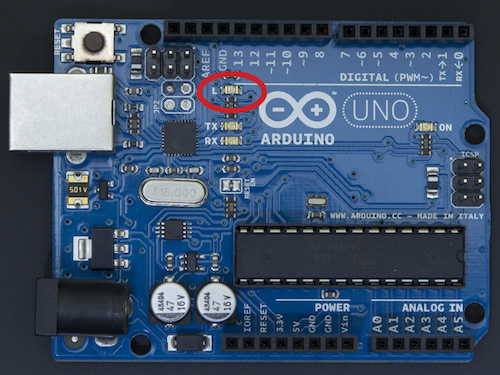

Figure 9. Arduino built in LED used to signal detection of audio signal


Op-amp Implementation: Acoustics
Next, to ensure that our microphone captures low-volume tones, we implemented a non-inverting op-amp to pick up audio signals. We first tested the our LM358AN op-amp was working correctly by setting up a non-inverting operational amplifier circuit shown in figure 11 and figure 12.

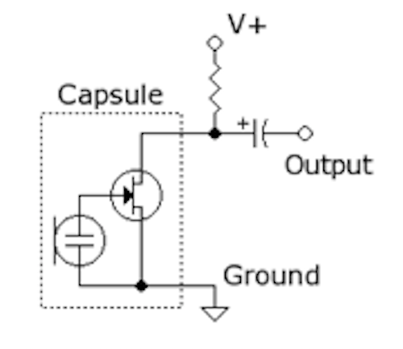

Figure 10. Original Microphone Circuit from Lab Handout


Figure 11. Non-inverting Op-amp template.

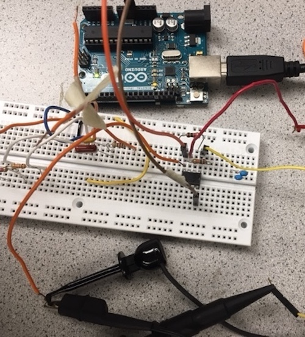

Figure 12. Op-amp implementation.

We then generated a 660 Hz signal with amplitude of 200 mVpp figure 13 into vin of the non-inverting op amp circuit and measured vout with an oscilloscope. The oscilloscope reading showed a gain of 10X figure 14 which shows that the op-amp works.

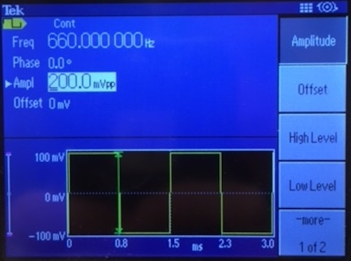

Figure 13. Signal generator output of 660 Hz 200mVpp


Figure 14. Oscilloscope reading of microphone with op-amp implemented.

Band-pass Filter
After successfully testing the op-amp, we attempted to add a multiple feedback band-pass filter shown in the schematic in figure 14. The band pass filter was designed to cut off frequencies above 750 Hz and below 550 Hz. However, the oscilloscope FFT readings showed a lot of noise and did not filter out high frequency noise. Figure 18 shows readings from vout of the band pass filter when a 800 Hz signal that was fed by a signal generator into vin of band pass filter. Also, Figure 20 shows readings from vout of the band pass filter when a 8,000 Hz signal that was fed by a signal generator into vin of band pass filter.

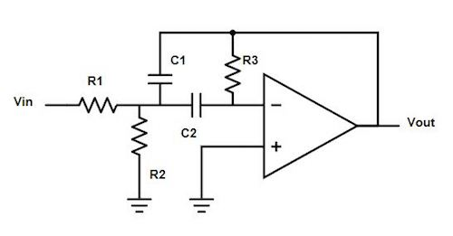

Figure 15. Multiple feedback band-pass filter.

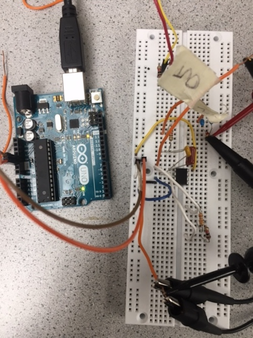

Figure 16. Band-pass implementation.

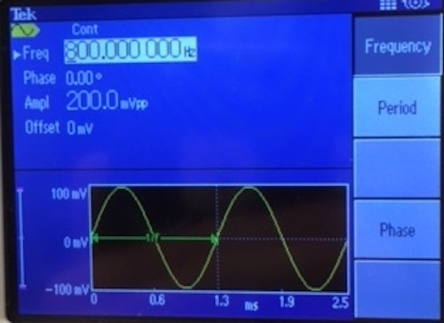

Figure 17. Signal generator output of 800 Hz 200mVpp


Figure 18. Oscilloscope FFT reading has a lot of noise

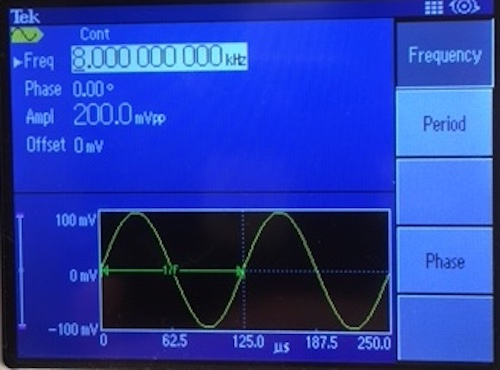

Figure 19. Signal generator output of 8,000 Hz 200mVpp

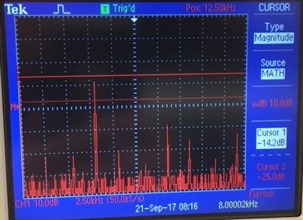

Figure 20. Oscilloscope FFT reading has a lot of noise

### Optics

The first step we did was to download the Open Music FFT library and look at the example sketch to get an idea of what the library could do. We also had to consider possible interference from the fluorescent lights in the room. We determined that this would not be an issue since the lights have a frequency of 50-60 Hz, however, since the signals we want to detect are in the kHz range. Additionally, adding a high pass filter to our system would diminish any possible interference from the lights.

#### Determining Signal Range and Needed Circuitry
The first thing we did was decide on what was a reasonable range that our robot should be able to detect the three treasures. Based on the size of the maze, we estimated that a range of one grid (diagonal of one square), or about twelve inches was an adequate range. 
			
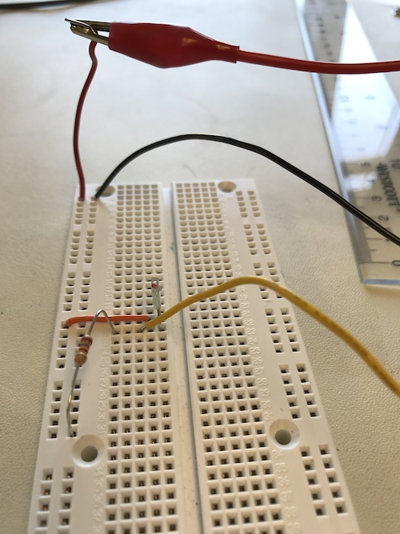 
Figure 21. IR Sensor Circuit      

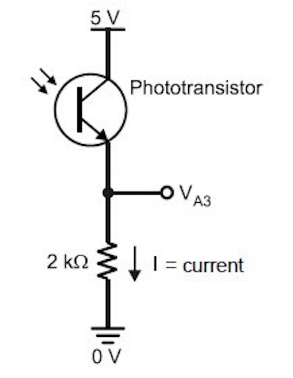 
Figure 22. Original IR Sensor Circuit from Lab Handout

First we tested the range of the IR sensor without any additional filters or amplifiers. We obtained a treasure from the TA and moved it closer to the IR sensor until the oscilloscope measured a recognizable sinusoidal waveform. We found that without any amplification, the treasure needed to be virtually on the sensor in order for any signal to be detected. Thus, some sort of amplifier was needed to obtain our desired range. 

.jpg)
Figure 23. IR Sensor Range Without Amplification

Here is the filter and amplifier circuit we used along with a schematic: 

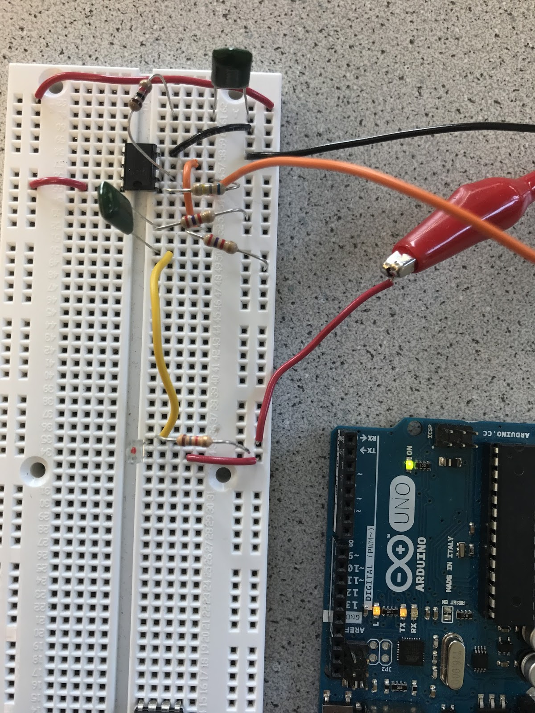

Figure 24. Optics Filter and Amplifier Implementation

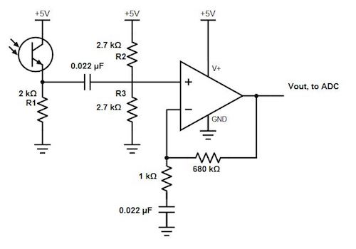

Figure 25. Optics Filter and Amplifier Circuit


Our circuit uses an non-inverting op-amp and high-pass filter. The resistors and capacitor attached to the negative leg of the op-amp determine the gain of our circuit. By changing the ratio of these two resistors, we can increase the gain and therefore the sensitivity of our circuit to input signals. 

#### Tuning the treasure + Op-amp Implementation

##### Overview of steps: 
Tune the treasure by adjusting the two potentiometers on the treasure and checking frequency on the FFT function on the oscilloscope. 
Replace the resistor on the branch that connects Vout and 1kΩ with increasing values to optimize gain and range. 
Check with various target frequencies if range requirements are met. 

##### Details:
To tune the treasure, we used the oscilloscope’s FFT function to  measure the frequency of the treasure. The potentiometer can be adjusted with a screwdriver until it outputs the desired frequency (i.e 7 kHz, 12 kHz, 17 kHz). The potentiometers to adjust the frequency are the ones closer to the switch labeled H9. One potentiometer is for fine tuning. 


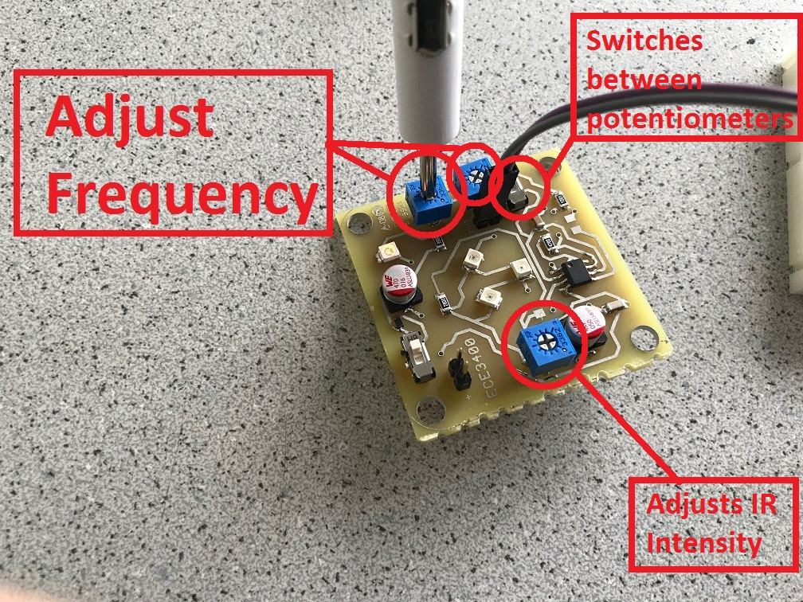

Figure 26. Treasure, photo from 3400 Lab Handout

Once the amplifier and high pass filter circuit is built, the circuit can be tested at the targeted frequencies and fine tuned to determine highest gain and range. Our target range was approximately 1 foot or the diagonal of one square of the grid (the longest distance necessary for the robot to detect treasure). 

To find the ideal resistor for the branch that connects Vout to the 1 kΩ resistor in the op amp, we first tested with the 7 kHz frequency. We determined that increasing resistance increases gain since gain is equal to the ratio of the R2 (variable resistor) and R1 (1 kΩ R) such thatAv = R2/1000 = -Vout/Vin. As we increased our resistance and gain, we found that the range of detection for our sensor also increases. We tested our op amp with resistors ranging in between 10 kΩs to 100 kΩs, and calculated gain by checking the Vout and Vin values on the oscilloscope. Our optimal resistor value was at 680 kΩs. 

Here are some examples to demonstrate this effect: 


Figure 27. The first measurement taken to test if the treasure works. At 7 kHz and the sensor being 0.5 inches away from the treasure, the gain is 10  but the range is extremely small. Optimizing the gain and range fixes this problem. 


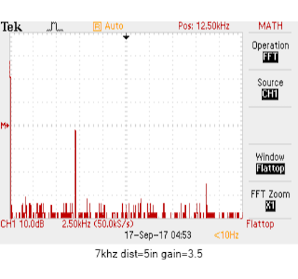

Figure 28. At 7 kHz and a gain of 3.5, the circuit detected the treasure from a maximum of 5 inches away. The farther the treasure was, the smaller the peak on the FFT. 
 


Figure 29. Resistance was approximately 800 kΩ. At 12 kHz and a gain of 1, we achieved a distance of 12 inches which means that even if the robot is a foot away, the treasure should be detected prominently. Here too, the farther the treasure, the smaller the peak on the FFT. 


Figure 30. Resistance was approximately 800 kΩ. At 17 kHz, the gain was also 1 (same as 12 kHz), but the range was also approximately a foot. However, we see that the FFT peak at 17 kHz is smaller than that of 12 kHz which indicates that the signal is weaker. If we moved closer to the treasure (i.e 10 inches away), the peak would be taller and the gain would increase by a little bit. 


We found that over time, even though the gain would increase, the measurable gain of our treasure and sensor was limited. Increasing the resistance beyond 1 MΩ increases the load on the circuit and can damage the circuit. 1 MΩ also picked up lower frequencies and had a lower gain which was not true for lower resistances. Thus, we decided that we would use either a 320 kΩ or 680 kΩ resistor. 

Our range for 7 kHz frequency for 320 kΩs was approximately 11 inches, and our range for 680 kΩs was over 12 inches which met our goals for detection. Hence, we chose the 680 kΩ. We observed that the gain began to steady, but increasing the resistance significantly increased the range. 

To further verify if range increases with resistance, we tuned the treasure to 12 kHz and 17 kHz, and repeated the steps above. We found that the 680 kΩs gives us a range of 12 inches for 12 kHz and a little less than 10 inches for 17 kHz. For 17 kHz, we decided this range was sufficient because the robot will always be moving so distance will naturally decrease. 


#### High-pass Filter
The filter in this circuit comes from the 0.022 μF capacitor and two 2.7kΩ resistors connected to the positive leg of the op-amp. These figures were chosen based on the cut-off frequency we wanted as the lower bound for signal detection. Although the lowest treasure we need to detect is 7 kHz, we chose 5 kHz as our cut-off frequency since the filtering response on Bode plots is not immediate and can filter out some frequencies near the nominal cut-off frequency.  Below our the calculations used to determine the cut-off frequency and RC values.

Let fC be the cutoff frequency. We selected fC based on the frequencies we wish to detect and chose C from the capacitors available in the lab room. Now we solve for REQ. We split REQ into two parallel resistors R so that the input to the positive leg of the op-amp will be in the middle of a voltage divider, eliminating some of the DC voltage offset issue. 


To test the filter, we used a function generator to sweep over frequencies and check if the circuit accurately filters out lower frequencies. As we modulated our frequency (decreased it), we observed that the amplitude of our output sinusoid stabilized close to the cut off. An example of this behavior can be found in this video. 

#### Amplification of Signal
To amplify the signal before it reaches the arduino, the circuit that we used includes an operation-amplifier (op-amp). After trying out different op-amps and failing to get enough of an amplification, we decided on the circuit in figure 12. The op-amp in this circuit is set up as a non-inverting op-amp, which has a gain of 1+ R2/R1. This improved amplifier and filter circuit increased the signals gain by about 12x. The capacitor connected to ground and the 1k resistor in the schematic (figure 12) provides low impedance to lower frequencies of the signal and helps filter out higher frequencies that are unnecessary. 

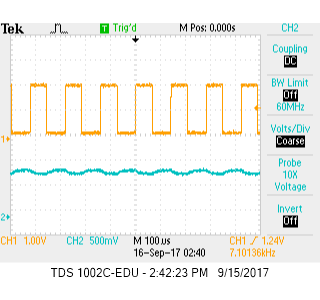

Figure 31. Original Amplified Signal


Figure 32.  Improved Amplified Signal

#### Performing FFT on the Arduino
Now with our circuitry built and tested, we attached it to the arduino and used Open Music Lab’s FFT to see if we obtained the same results seen on the oscilloscope.
To verify that the arduino’s FFT result in the correct frequencies. We calculate the frequency range of each bin using the following equation:

Each bin frequency = ((16MHz / 32 prescaler) / 13 clock cycles) / 256 bins = 150 Hz 

To generate data, we utilized the fft_adc_serial sketch to serially read FFT output values continuously. The sketch can be found under File → Examples → FFT → fft_adc_serial.ino (ensure that the Open Music Library is installed and imported). An analog to digital channel (ADC) was initialized and used to read FFT values. Here is a commented version of our code: 

```
/*
fft_adc_serial.pde
guest openmusiclabs.com 7.7.14
example sketch for testing the fft library.
it takes in data on ADC0 (Analog0) and processes them
with the fft. the data is sent out over the serial
port at 115.2kb.
*/

#define LOG_OUT 1 // use the log output function
#define FFT_N 256 // set to 256 point fft

#include <FFT.h> // include the library

void setup() {
  Serial.begin(115200); // use the serial port
  TIMSK0 = 0; // turn off timer0 for lower jitter
  ADCSRA = 0xe5; // set the adc to free running mode
  ADMUX = 0x45; // use adc5
  DIDR0 = 0x01; // turn off the digital input for adc0
}

void loop() {
  while(1) { // reduces jitter
    cli();  // UDRE interrupt slows this way down on arduino1.0
    for (int i = 0 ; i < 512 ; i += 2) { // save 256 samples
      while(!(ADCSRA & 0x10)); // wait for adc to be ready
      ADCSRA = 0xf5; // restart adc
      byte m = ADCL; // fetch adc data
      byte j = ADCH;
      int k = (j << 8) | m; // form into an int
      k -= 0x0200; // form into a signed int
      k <<= 6; // form into a 16b signed int
      fft_input[i] = k; // put real data into even bins
      fft_input[i+1] = 0; // set odd bins to 0
    }
    fft_window(); // window the data for better frequency response
    fft_reorder(); // reorder the data before doing the fft
    fft_run(); // process the data in the fft
    fft_mag_log(); // take the output of the fft
    sei();
    Serial.println("start");
    for (byte i = 0 ; i < FFT_N/2 ; i++) { 
      Serial.println(fft_log_out[i]); // send out the data
    }
  }
}

```

After collecting data, we copied and pasted a single range of bins (128 bin values) into excel and used a bar graph to visualize amplitudes. 

Now looking at the bin responses, we can calculate the frequency with the highest amplitude in each signal. Note that we ignore the first few bins because with the FFT, the first few bins do not contain valid data.


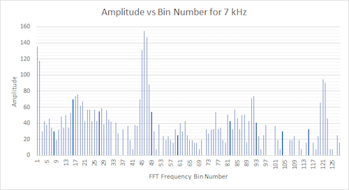
Figure 33. Amplitude vs FFT frequency. Treasure frequency was 7 kHz. The bin with the highest amplitude was bin 46. Using the frequency range of each bin, bin 46 corresponds to a frequency of 46 * 150 Hz = 6,900 Hz.

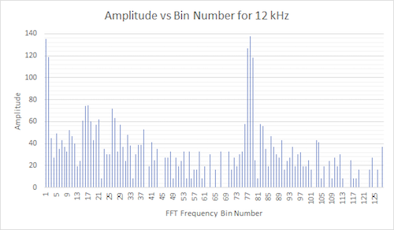
Figure 34. Amplitude vs FFT frequency. Treasure frequency was 12 kHz. The bin with the highest amplitude was bin 78. This corresponds to a frequency of 78 * 150 Hz = 11,700 Hz.


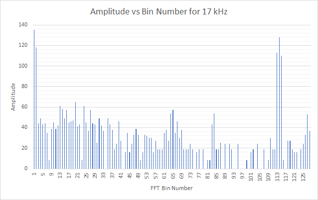
Figure 35. Amplitude vs FFT frequency. Treasure frequency was 17 kHz. The relevant bin is bin 114 which equates to 114 * 150 Hz = 17,100 Hz.

We see that the bin number with the highest magnitude is indeed the frequency we calibrated the treasure to. Slight differences such as 12 kHz vs. 11,700 Hz can be attributed to the inaccuracy of us tuning the treasure based on the oscilloscope’s display.


