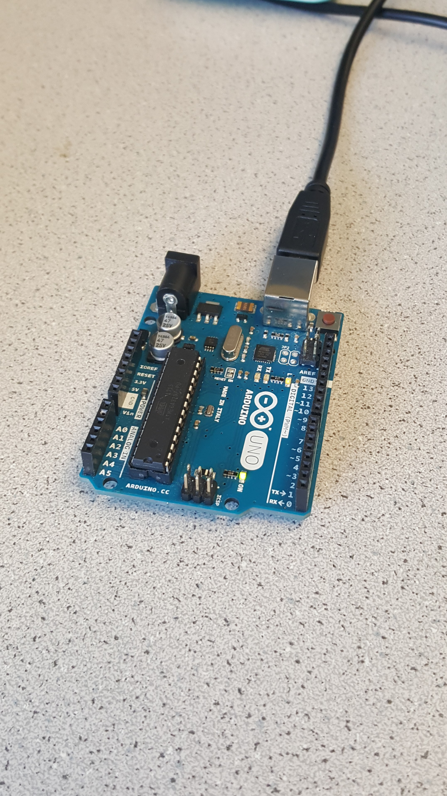
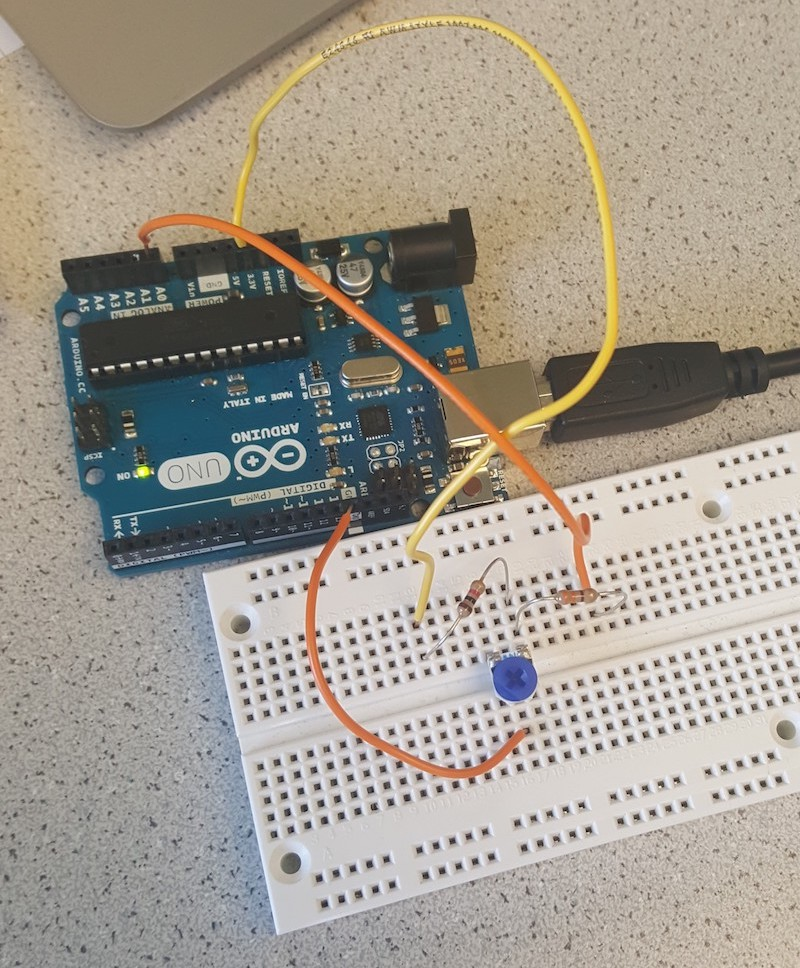
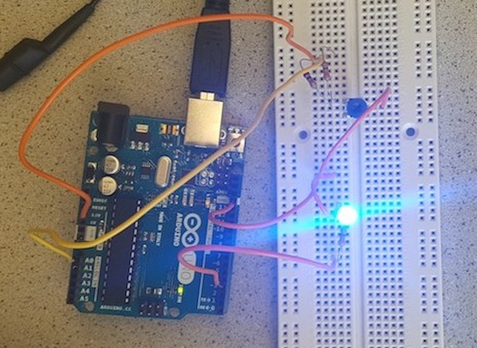
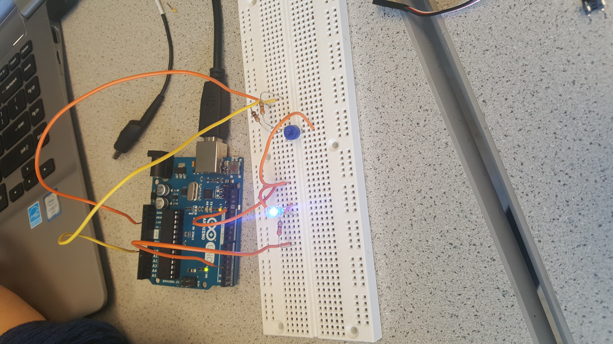
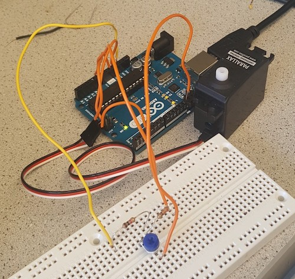
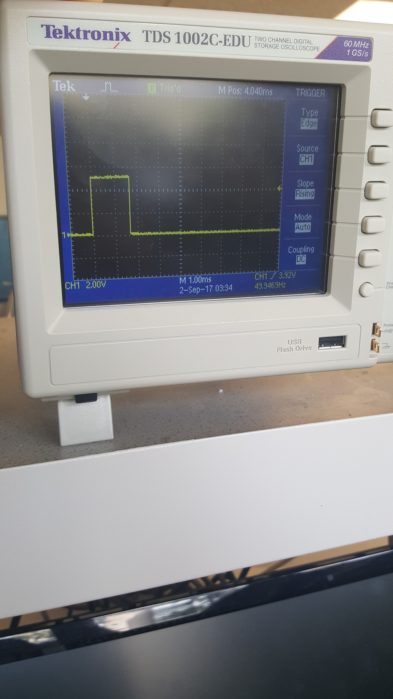
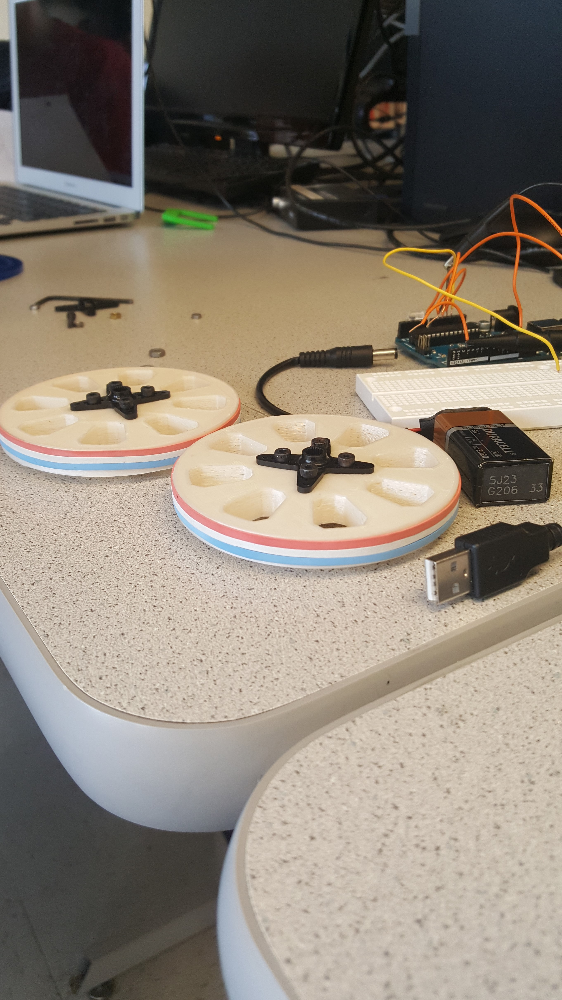

# Lab 1

## Premise
For the team to gain basic familiarity with the various features of the Arduino UNO and Arduino IDE; for the team to begin preliminary construction of the robot using aforementioned familiarity.

## Required Materials
- 1 Arduino Uno
- 1 USB A/B cable
- 2 Continuous rotation servos
- 1 LED
- 1 Potentiometer
- Electrical Tape
- Soldering Iron
- Shrink Wrap
- Several resistors
- At least one in 330 Ohm range
- At least one in 10 kOhm range
- 1 Solderless Breadboard
- Handful solid-core wires
- Wire Stripper
- Various robot components
- 1 Chassis
- 2 Wheel trusses
- 2 Wheels (approx. 4’ diameter)
- 2 Rubber bands
- 8 Bolts (approx. 0.5’)
- 8 matching nuts
- 6 enthusiastic and cooperative comrades!

## Procedure

### Part 1: Modify the Blink Sketch
First and foremost, install the Arduino IDE from this link.

The first part of the lab involves modifying the blink sketch -- provided by default in the Arduino IDE -- to blink an external LED. You can find the blink sketch in File > Examples > Basics > Blink (fig 1).

Figure 1: Blink Sketch

	To blink an external LED, first declare a variable, ledPin, which stores a number between 0 and 11. This number will determine which pin outputs the the loop signal. In setup() and loop(), replace LED_BUILTIN with your variable, ledPin (fig. 2).

Figure 2: Modified Blink Sketch. We chose 9 as our ledPin.

Connect the positive end of the LED to the pin specified in ledPin, and connect the negative end of the LED to ground. When wiring your circuit, remember to insert a 330 Ohm resistor in order to protect your Arduino from a short circuit! Compile and run the program. If everything went right, it should look something like this:

[Blinking LED Video](https://drive.google.com/file/d/0B5FA_MhAcyNYMlNTUUlYcjlwR0k/view)

