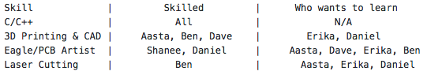

Location: Upson 357

Date/Time: Sep 3, 2017, 6:30 pm – 7:30 pm

Leader: Daniel

Attendance: Shanee, Erika, Aasta, Ben, Dave, Daniel

Scribe: Daniel

## Agenda details:

### I. Logistics
  a. Ensured everyone has access to Google Drive, GitHub, and Slack.
  
  b. Scheduled times most of us can meet at open lab hours throughout semester.
  
    i. Lab open hours: Tuesday 1:30-6:00, Wednesday 4:30-6:30, and Thursday 1:00-3:00
    
      .  Tuesdays: Erika, Aasta, Daniel
      .. Wednesdays: Shanee, Ben, David
  
  c. Reviewed/Edited Gantt Chart on Google Drive

### II. Skills and Training
  a. Reviewed skillset of our team
  
  
  
  b. Assignment to each member to learn how to use either 3D printer + CAD, Laser Cutter, Eagle PCB Design, C/C++
  
  c. Maker Lab Access granted

### III. Lab 1
  a. Grading check sheet: https://cei-lab.github.io/ece3400/Grading/Lab_score.html

  b. Assign Remaining Tasks
  
  c. Wait for lab to open on Tuesday
  
    i. Finish assembly of robot
    
  d. Begin Today
  
    i. Write Software
    
    ii. Testing Procedures
    
    iii. Lab Report

### IV. Order Parts

  a. Discussed robot design. Will assign each member to look into a few components.

  b. Developed a component selection trade study excel file on the Google Drive.

### V. Website Design

Always room for improvement.

### VI. Action Items
  a. Software for Lab 1: Erika, Aasta, Shanee

  b. Update Website, Lab 1 Report, Write Tests for Lab 1 Autonomous Robot: Daniel, Dave, Ben

  c. Skills this week: 
  
    i. All learn to use GitHub
