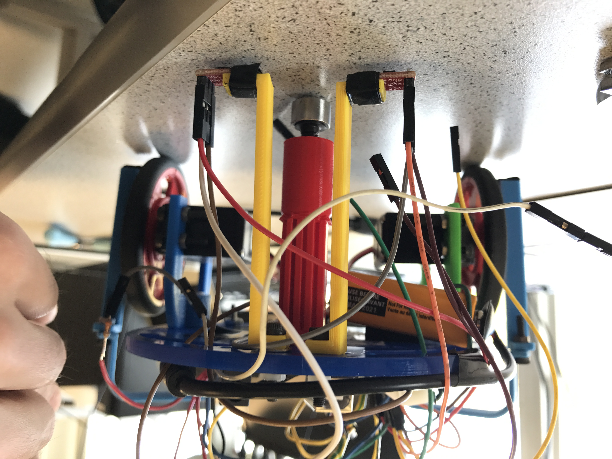
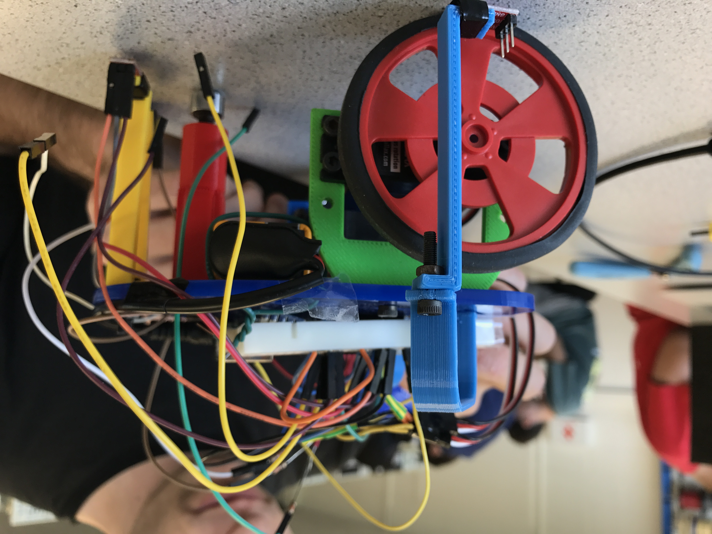

## Milestone 1: Line Follower

Our goal for milestone 1 was to have our robot autonomously follow a line in a figure-8 pattern. To implement this ability, we started off by deciding the arrangement of the line sensors to recognize a straight path along a piece of black tape on a white background. After achieving this functionality, we developed our code to enable the robot to traverse a grid of lines and follow a figure-8 pattern. 

## Part 1: Line Detection
For our robot to detect and follow a simple, straight line, we first tested the QRE1113 line sensors to see what values corresponded with light and dark surfaces. With those values, we decided to place two line sensors in the center, spaced apart with a distance slightly greater than the width of the line. Using two sensors instead of four guaranteed that there would be sufficient analog pins. With this design the two values provide information on which way to adjust:



Figure 1. Placement of line sensors on robot. (Front View)



Figure 2. Placement of line sensors on robot. (Side View)

Now we determine under what conditions should each servo move or stop. Here's the logic we used:
>If left sensor detects line and right sensor detects line (i.e. the sensor detects a value greater than the threshold which indicates a dark surface, where a greater value is more dark), robot is perpendicular to the line and needs to turn in one direction.

>If left sensor is on the line and right sensor is not, robot drifted right and needs to turn slightly left.

>If right sensor is on the line and left sensor is not, robot drifted left and needs to turn slightly right.

>If both sensors detect light (are not on the line), then the robot is centered on the line. 

>If robot is off the line, one wheel stops while the other wheel corrects heading.

Link to a short video of our robot following a straight line: [Video](https://youtu.be/OisnwRRMmFI)

Another video of our line-following robot, this time following a curve: [Video](https://youtu.be/xKgfWW6A0Mw)

Our robot appears slower in the second video due to the curvature of the line. We will not have to worry about following a curved line while traversing the maze, however, so our robot will be able to move faster.

## Part 2: Autonomous Figure-8 Movement
The next part of our milestone 1 involved turning and detecting intersections in a grid. An intersection was detected when both light sensors were on a line, indicating that the robot should turn 90 degrees right or left, where direction is determined by a coded sequence. To move the robot in a figure-8 pattern, we kept track of the direction the robot would turn (x = 1 indicates right turn, x = 0 indicates left turn) and the number of consecutive turns in that direction (variable y). For example, if x = 0, and y = 1, the robot would turn left at an intersection and would keep turning left at intersections until the number of consecutive left turns complete is 4. At that point, y is greater than 4, so the robot would change its turn direction (x = !(x)), restart its tracking of consecutive turns (y = 1), and turn right four times. This pattern repeats in an infinite loop.

Here's a link for video of our robot's autonomous figure-8 movement:  [Video](https://youtu.be/ZuVscGUPQMY)
Below is a commented version of the code used:
```
#include <Servo.h>
int QRE1113_PinL = 0; // connect left light sensor to analog pin 0
int QRE1113_PinR = 1; // connect left light sensor to analog pin 1
int onLine = 850;     // threshold value for sensor on line
int onStatL;          // returns boolean for statment "left sensor is on the line"
int onStatR;          // returns boolean for statment "right sensor is on the line"

int val = 100;        //normal motor speed
int offVal = 140;     //motor speed when sensor is off line, faster to correct
Servo left;           //set up left and right motor
Servo right;
int x=0;              // Determines turn direction in binary
int y=1;              // Keeps track of number of turns

void setup() {
  Serial.begin(9600);
  left.attach(5);    // connect left servo to pin 5
  right.attach(3);   // connect right servo to pin 3
}

void loop() {
  //determine whether robot is on the line
   int QRE_ValueL = analogRead(QRE1113_PinL); //measure light value for left sensor
   int QRE_ValueR = analogRead(QRE1113_PinR); // measure light value for right sensor

  //determine line status for left sensor
   if (QRE_ValueL > onLine) onStatL = 1;
   else onStatL = 0;

   //determine line status for right sensor
   if (QRE_ValueR > onLine) onStatR = 1;
   else onStatR = 0;

  //drive servos
   // if both sensors on either side of line
   if(!onStatL && !onStatR){
    left.write(100);            
    right.write(80);
    Serial.println("Centered");
   }

   else if(onStatL && !onStatR){
    left.write(90);            
    right.write(80);
    Serial.println("Robot drifted left");
   }

   else if(!onStatL && onStatR){
    left.write(100);            
    right.write(90);
    Serial.println("Robot drifted right");
   }
  
    else if((onStatL) && (onStatR)){

      if (x) {
        left.write(90);
        right.write(80);
        y++;
        if (y>4) { 
          x=0;
          y=1;
        }
        Serial.println("Turn 90 Degrees Right");
        delay(1000);
      }
      else {
        left.write(100);
        right.write(90);
        y++;
        if (y>4) { 
          x=1;
          y=1;
        }
        Serial.println("Turn 90 Degrees Left");     
        delay(1000);                                     
      }
      
  }

    //if either light sensor is off the line (has onStat_ == 0)  
  else{
     left.write(100);
     right.write(100);
  }

   Serial.print("\n");
   delay(2);
   
}
```

